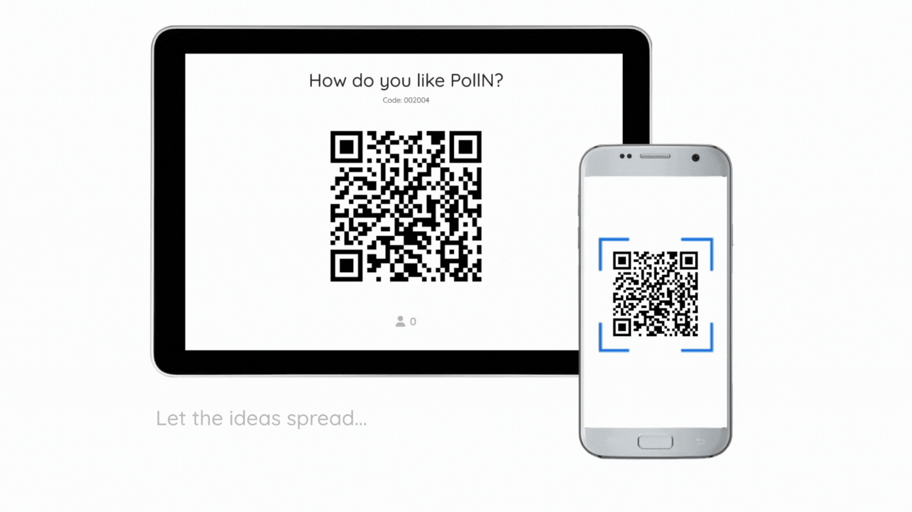
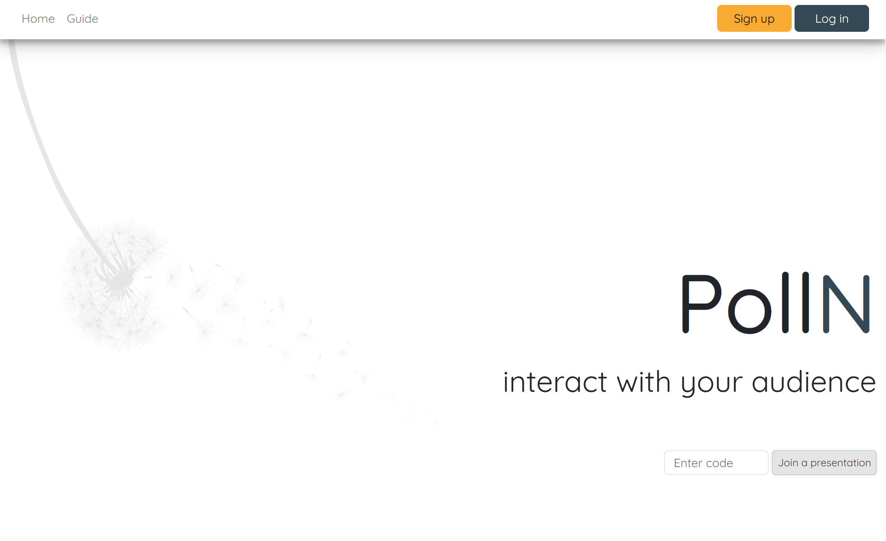

<div align="center">
  <br>
  <h1><b>PollN</b></h1>
  <strong>helping ideas spread like pollen</strong>
</div>
<br>
<table align="center" style="border-collapse:separate;">
  <tr>
    <td style="background: #344955; border-radius:20px; border: 5px solid transparent"><small>Python</small></td>
    <td style="background: #344955; border-radius:20px"><small>Django</small></td>
    <td style="background: #344955; border-radius:20px"><small>JavaScript</small></td>
    <td style="background: #344955; border-radius:20px"><small>mySQL</small></td>
    <td style="background: #344955; border-radius:20px"><small>Bootstrap</small></td>
    <td style="background: #344955; border-radius:20px"><small>Chart JS</small></td>
  </tr>
</table>
<hr>


<hr>
<br>

# Table of Contents
- [Introduction](#introduction)
   - [Installation](#installation)
   - [How PollN works](#how-polln-works)
- [Code and organization](#code-and-organization)
   - [The project folder: polln](#the-project-folder-polln)
   - [The App folders: website, dashboard, present, and poll](#the-app-folders-website-dashboard-present-and-poll)
   - [The static folder](#the-static-folder)
   - [Templates](#templates)
   - [mydb.py](#mydb.py)
   - [env, gitignore, requirements](#env-gitignore-requirements)
   - [Third-party code](#third-party-code)
- [About and license](#about-and-license)
- [Distinctiveness and complexity](#distinctiveness-and-complexity)
<br>

# Introduction
 PollN is an interactive presentation software for real-time audience engagement and feedback.
 Users can use PollN for live polling, quizzes, and surveys.

## Installation

<details>
   <summary>1. Clone this repository</summary>

   >\
   > More information on how to clone this repository available at https://docs.github.com/en/repositories/creating-and-managing-repositories/cloning-a-repository
   > It is recommended that you set up a virtual environment. More information: https://packaging.python.org/en/latest/guides/installing-using-pip-and-virtual-environments/#:~:text=To%20create%20a%20virtual%20environment,virtualenv%20in%20the%20below%20commands.&text=The%20second%20argument%20is%20the,project%20and%20call%20it%20env%20.
   ><br/><br/>

</details>

<details>
   <summary>2. Install dependencies</summary>

   >\
   > ```pwsh
   >pip install -r requirements.txt
   >```
   > 
   > If you make changes to the project, you can always update the requirements with
   > 
   > ```pwsh
   >pip freeze > requirements.txt
   >```
   ><br/><br/>

</details>

<details>
   <summary>3. Make sure you have mySQL installed</summary>

   >\
   > You can install mySQL here: https://dev.mysql.com/downloads/installer/
   > W3Schools has a great article on it: https://www.w3schools.com/mysql/mysql_install_windows.asp
   >
   >If you are new to mySQL with django, you might find this video helpful: https://www.youtube.com/watch?v=t10QcFx7d5k
   ><br/><br/>

</details>

<details>
   <summary>4. Change the DB password</summary>

   >\
   > Go to the PollN folder and open the settings.py file
   > ```python
   > DATABASES = {
   >    'default': {
   >    'ENGINE': 'django.db.backends.mysql',
   >    'NAME': 'pollnmysql',
   >    'USER': 'root',
   >    'PASSWORD': os.environ.get('MY_SQL_ROOT_PASSWORD'), # Your password here
   >    'HOST': 'localhost',  
   >    'PORT': '3306',
   >     }
   > }
   >```
   >
   > Alternatively, you can create an .env file in the main folder, then create the variable 'MY_SQL_ROOT_PASSWORD'='your_password_here'
   > 
   > python-dotenv should be a dependency already. More information here:
   > https://pypi.org/project/python-dotenv/
   ><br/><br/>

</details>

<details>
   <summary>5. Run the mydb.py file</summary>

   >\
   > Open the mydb.py file. This is the file that should create the database. Run the following terminal command:
   > ```python
   > python mydb.py
   >```
   >
   > <code>python manage.py migrate</code> initiates the database.
   > 
   > Run:
   > ```pwsh
   > python manage.py makemigrations website
   > python manage.py makemigrations dashboard
   > python manage.py migrate
   >```
   > 
   ><br/><br/>

</details>

<details>
   <summary>6. Create superuser and run the server</summary>

   >\
   > Create the superuser by typing the following in the terminal:
   > ```pwsh
   > python manage.py createsuperuser
   >```
   >
   > Set up a username, email, and password. Then start the server:
   > 
   > Run:
   > ```pwsh
   > python manage.py runserver
   >```
   > 
   ><br/><br/>

</details>

<br>
Open up your browser to see the homepage and start exploring.
<br><br>



## How PollN works

The user must create an account, create a project and add at least one question to the project. The user will then be able to gather responses from one or more respondent in the following way:
<br>

1. **Live polling**:
The users can present the project and gather the answers live. The respondents will scan the QR code on the first page of the presentation, which will lead them to the project's questions. The users can see how many responses were received. When the users move on to the second presentation slide, the poll will be closed. The next prosentation slides will be an analysis of the gathered questions.

2. **Sending the poll link**:
The user can open the poll and send the link to the project per email, WhatsApp or any preferred mean. The user can close the poll to see the results in table-format. The users can download the results in excel (csv), and re-open the poll to gether the next set of answers should they want to.
<br>

The users can ask three type of questions: open-ended, question and answer (Q&A), or multiple-choice.
The questions of type Q&A must have a correct answer, and multiple-choice may or may not have a correct answer. The user can also control the order in which questions appear in a poll by dragging elements into the desired position.

Users can allow for anonymous answers or request a password to access the poll. They may also choose if they want the respondents to see the answers (to questions where a correct answer was given) after they submitted their answers.

Respondents can access the poll in 3 different ways: scanning the QR code with their phones (during a presentation), via the poll link, or inputting the poll code in the specified field on the homepage. Polls can only be accesed when they are open. 

The user can close a poll any time. Poll opening and closing will happen automatically during a presentation. Polls can also get closed when the user makes changes to the structure of the project, such as adding/editting questions, editting the project, or changing the question order.

A full guide on how to use PollN is provided in the url /guide.
<br><br>

# Code and organization
The polln application has the following structure:
- It is divided into 4 apps: website, dashboard, present, and poll
- Each app folder contains a views.py and templates folder. Views might import from a utils.py.
- Only two apps have db models in models.py: website and dashboard
- The static folder is a standalone. All css and JS files, as well as media are there
- A standalone templates folder contain shared templates only.

Let's take a look at what each app does.
<br>

## The project folder: polln
<br>
The polln folder is the standard django application folder. Changes were made to settings.py, please check the installation section for more information.
<br><br>

## The App folders: website, dashboard, present, and poll

### **1. website**
Contains the files responsible for the homepage, guide page, sign-up, and log-in. It is responsible for the creation and deletion of user accounts.
### **2. dashboard**
Contains most of PollN's logic. This is where projects and questions get added, deleted, or modified. It contains the 'My Projects'/'Dashboard' views, project pages, and the result's page. A utils.py file also contains helpful functions used by it's views.py file, but also in the views file of other apps.
### **3. presentation**
Contains the logic needed for the user to present and gather the responses in live polling. It will make requests to check the number of responses comming in to show on the presentation page, and make use of chart JS to display the results of multiple-choice questions, for instance.
### **4. poll**
Will check if the respondent has access to the poll, check if the poll is open, and gather poll results. It is responsible for the way the project is viewed by respondents. 

## The static folder
Shared styling is under common.cs, while shared JS functions are in main.js.
Styling and JS logic, as well as media files (pictures, videos, icons) are organized into subfolders named after the app using them. Website, dashboard, present, and poll have their own static folder here. the app_preview folder contains media used in this readme.md while favicon_io is the folder containing the favicon for this application.

Classes were named after their origin. For instance, the class 'BASE-hide' (or any class starting with 'BASE') will be in the common.css file. Any class starting with 'DASHBOARD-...' will be styled in the dashboard css file, and so on. Bootstrap was also used.
<br>

## Templates
Each app counts with its own templates folder. The standalone 'templates' folder contains the html files shared by 2 or more apps.
<br>

## mydb.py
This file is only to be used for the database creation. PollN uses mySQL. Check the installation instructions for more information.
<br>

## env, gitignore, requirements
As noted in the installation instructions, an .env file (and a .gitignore so that the env is not pushed to git) was created to save the mySQL database password. You can use this app by adding your own mySQL password to the settings.py file in the polln folder.

The requirements.txt hold dependencies such as dotenv and mysql-connector-python.
<br>

## Third-party code
Writing the codebase required some research. Source for media such as icons are included in the code. In comments you will also see helpful sources for styling (for instance, border-boxes), and links to helpful content that made this project possible. Some functions that were written by other authors or based on someone else's logic are clearly described as such and contain the original source link and author (when available).

Some special mentions:

- To enable drag and drop on mobile devices, I used the DragDropTouch polyfill from Bernardo-Castilho. More information at https://github.com/Bernardo-Castilho/dragdroptouch
- The library qrcode was used for the code generation:  https://pypi.org/project/qrcode/
- Chart JS was used to create the bar chart: https://www.chartjs.org/
- Damjan Pavlica made swipe effects on the presentation possible with https://stackoverflow.com/a/56663695/14517941
- Kyle from Web Dev Simplified wrote the question drag&drop login in https://www.youtube.com/watch?v=jfYWwQrtzzY&t=655s


# About and license
This project was submitted as the capstone project for CS50w from HarvardX.
More information about the CS50w requirements available at https://cs50.harvard.edu/web/2020/projects/final/capstone/

This is a personal project completed by the author, which you are welcome to use and modify at your discretion. (MIT Licence)

If you liked this project, motivate the developer by giving it a :star: on Github!
<br>

# Distinctiveness and complexity
This Django-vanilla-JavaScript project is very distinct in nature than the projects from the lessons and from other final projects submitted by students - where a live polling app could not be found up to the date of writing (June 6, 2023).
PollN is also more complex in that it involved the creation of four inter-connected django apps holding multiple template and styling files, communication from back- and front-end via JSON files, interactive interface with animations, the use of the MySQL database, and changes in the Settings.py beyond what was covered in the course. 
